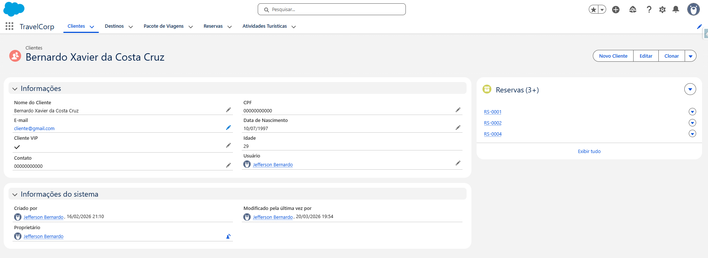
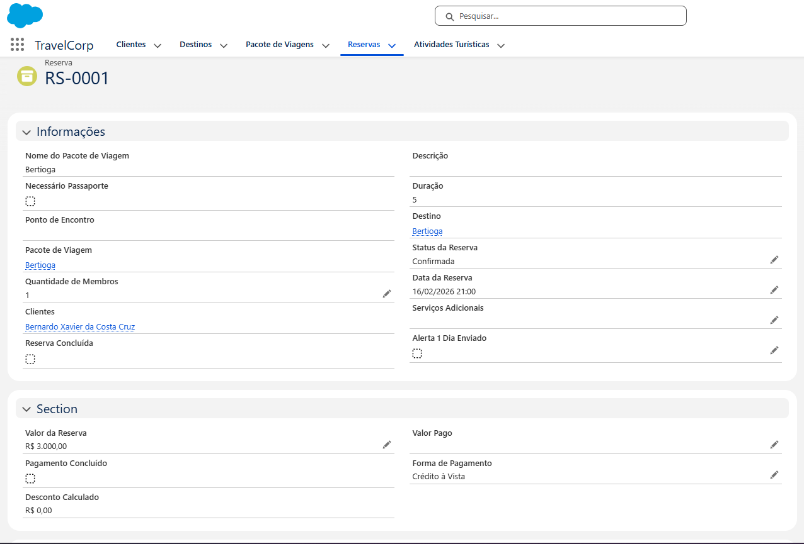
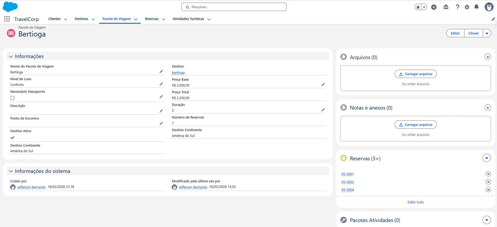

# 🚀 Projeto Salesforce - TravelCorp (Agência de Viagens)

## 📌 Visão Geral

Projeto prático desenvolvido no Salesforce com o objetivo de simular um **cenário real de negócio**, focado na gestão de uma agência de viagens.

A solução foi construída de forma incremental, replicando desafios comuns do dia a dia de um **Salesforce Admin / Analista de CRM**, incluindo modelagem de dados, automações e garantia da qualidade da informação.

---

## 🎯 Problema de Negócio

Agências de viagem precisam gerenciar clientes, pacotes e reservas de forma eficiente, evitando erros manuais, retrabalho e falhas de comunicação com o cliente.

---

## 💡 Solução Desenvolvida

Foi criada uma aplicação chamada **TravelCorp**, capaz de:

- Centralizar o gerenciamento de clientes, pacotes e reservas  
- Automatizar processos operacionais  
- Melhorar a qualidade dos dados  
- Criar comunicação automática com clientes  

---

## 🧠 Principais Entregas

### 📊 Modelagem de Dados

- Criação de objetos personalizados (**Cliente, Pacote e Reserva**)  
- Relacionamento entre objetos (mestre-detalhe)  
- Estrutura orientada à integridade e escalabilidade  

---

### ⚙️ Automação com Flow Builder

- Criação de **Screen Flow** para facilitar o processo de vendas  
- Automação de criação de registros  
- Disparo de **emails automáticos de lembrete de viagem**  

📌 Exemplo de impacto:
- Redução de tarefas manuais  
- Padronização da comunicação com clientes  

---

### 🔒 Qualidade e Governança de Dados

- Implementação de **regras de validação**  
- Padronização de campos  
- Ajustes de layout para melhor usabilidade  

📌 Resultado:
- Dados mais confiáveis  
- Menor risco de inconsistência  

---

### 📩 Integração com Email Template

- Criação de lógica para envio de emails automatizados  
- Uso de **campos fórmula** para contornar limitações do Salesforce  
- Criação de registros de **Contato** para viabilizar envios  

---

### 📥 Simulação de Carga de Dados

- Inserção de dados para testes  
- Simulação de cenário real de operação  

---

## 🛠️ Stack Utilizada

- Salesforce CRM  
- Flow Builder (Screen Flow e automações)  
- Modelagem de Dados  
- Regras de Validação  
- Email Templates  

---

## 📈 Resultados e Impacto

- Estrutura completa de CRM funcional  
- Processos automatizados reduzindo esforço manual  
- Melhoria na organização e confiabilidade dos dados  
- Simulação prática de um ambiente corporativo  

---

## 📚 Aprendizados Aplicados

- Pensamento analítico aplicado ao CRM  
- Lógica de automação dentro do Salesforce  
- Resolução de limitações da plataforma com soluções alternativas  
- Boas práticas de organização de dados  

---

## 🚀 Diferenciais

✔ Projeto baseado em cenário real  
✔ Evolução incremental (como projetos corporativos)  
✔ Integração entre dados, automação e experiência do usuário  
✔ Forte foco em qualidade e governança de dados  

---

## 📸 Demonstração

### 👤 Cliente

### 📑 Reserva

### 🌍 Pacote de Viagem

## ⚙️ Automação em Funcionamento

### 📑 Criar Novo Cliente

### 📑 Enviar Email

## 👨‍💻 Sobre o Autor

**Jefferson Bernardo Juliano da Silva**

Profissional na área de **Dados e Salesforce**, com experiência prática em:

- Administração Salesforce  
- SQL  
- Power BI  
- Excel  
- Automação de processos  
- Modelagem de dados  

📎 LinkedIn: https://www.linkedin.com/in/jefferson-bernardo-juliano/

📎 GitHub: https://github.com/Jefferson-Bernardo-Juliano

📎 Trailblazer: https://www.salesforce.com/trailblazer/jefferson-bernardo

---

## 📌 Status

✅ Concluído  
🚀 Em evolução (novas automações e melhorias futuras)  

---

⭐ Se esse projeto te chamou atenção, fique à vontade para se conectar comigo no LinkedIn!
